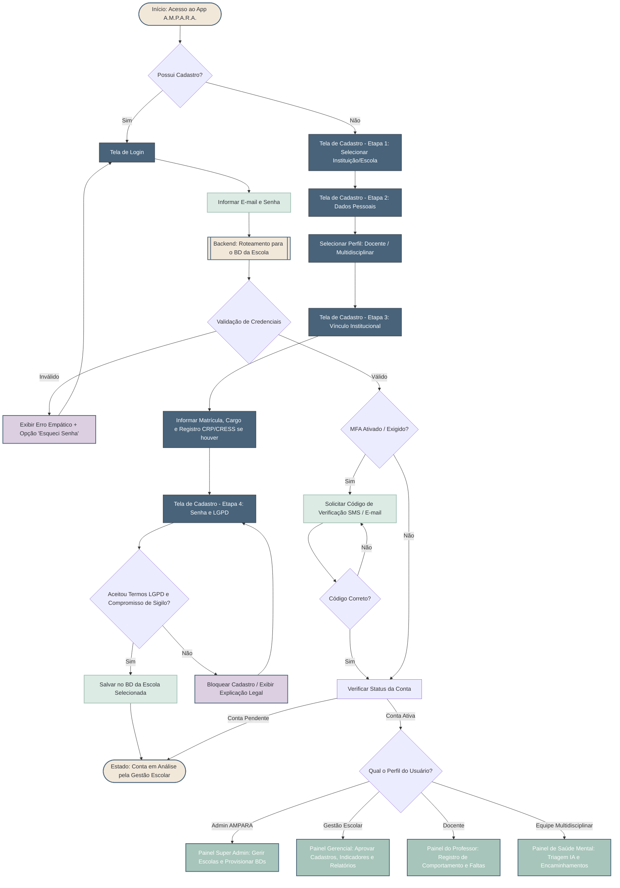

# Fluxo de Cadastro e Login (App A.M.P.A.R.A.)

---

### Notas de Implementação Técnica

1. **Arquitetura de Banco de Dados (Database-per-Tenant)**
* Como cada escola terá um banco de dados separado, você precisará de um **Banco de Dados "Master" (Global)**.
* **No Login:** Quando o usuário digita o e-mail, o backend deve bater nesse Banco Master para descobrir a qual escola aquele e-mail pertence (tabela de mapeamento `usuario_escola: email -> tenant_id/db_url`). Só então a senha é validada no banco de dados específico daquela escola.
* **No Cadastro:** A "Etapa 1: Selecionar Instituição/Escola" consulta o Banco Master para listar as escolas ativas. Quando o usuário finaliza o cadastro, os dados vão para o banco de dados da escola escolhida.

2. **Criação de Contas e Hierarquia (RBAC)**
* **Admin AMPARA (Super Admin):** Perfil criado via infraestrutura (não tem tela de cadastro no app). Tem acesso a um painel onde clica em "Nova Escola", o que dispara o script de provisionamento de um novo banco de dados. Em seguida, ele cria a conta do **Gestor Escolar** para aquela escola.
* **Gestão Escolar:** Recebe o acesso do Admin AMPARA. Faz login no app e seu painel principal (além dos relatórios) terá uma área de "Pendentes de Aprovação", onde caem os cadastros feitos pelos professores e psicólogos/assistentes sociais da sua escola.
* **Docente e Multidisciplinar:** São os únicos perfis que passam pelo fluxo de *Cadastro (Onboarding)* descrito no diagrama. Eles nunca nascem com a conta "Ativa", sempre caem no status "Pendente" aguardando o aceite do Gestor daquela escola específica.

3. **Remoção do Gov.br**
* O fluxo de autenticação via SSO (Secretarias/Gov) foi removido do escopo inicial para reduzir complexidade, focando na validação e aprovação manual in-app via Gestão Escolar. Pode ser reintroduzido futuramente plugado ao nó "C" (Tela de Login).
